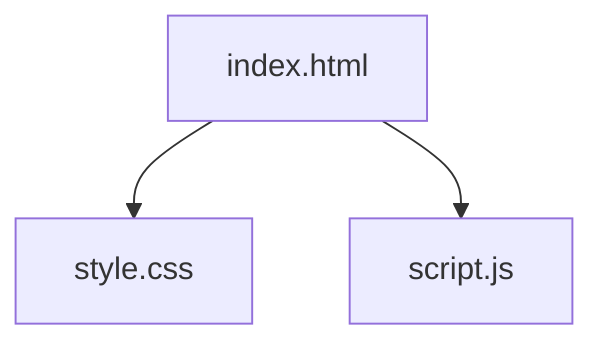

# SillaVibe 타일 기억력 게임

이 게임은 컴퓨터가 보여주는 타일의 순서와 소리를 기억하고 그대로 따라 하는 기억력 테스트 게임입니다.

## 게임 목표

컴퓨터가 제시하는 타일의 순서를 정확하게 기억하여 최대한 많은 스테이지를 클리어하는 것이 목표입니다.

## 게임 방법

1.  **게임 시작**: `시작` 버튼을 눌러 게임을 시작합니다.
2.  **순서 암기**: 컴퓨터가 무작위 순서로 타일을 노란색으로 밝히며 피아노 소리를 냅니다. 이 순서를 잘 기억하세요.
3.  **순서 입력**: "따라해보세요!" 메시지가 나타나면, 기억한 순서대로 타일을 클릭합니다.
4.  **성공**: 순서를 정확하게 맞혔다면 "성공!" 메시지와 함께 `다음 단계` 버튼이 나타납니다. 버튼을 눌러 다음 레벨에 도전하세요.
5.  **실패**: 순서를 틀렸다면 게임오버가 되며, 도달한 최고 기록이 오른쪽 스코어보드에 저장됩니다. `재시작` 버튼을 눌러 처음부터 다시 시작할 수 있습니다.

## 난이도

게임은 스테이지와 레벨로 구성되며, 진행할수록 점점 어려워집니다.

-   **스테이지**: 총 10개의 레벨로 이루어져 있습니다. 10레벨을 클리어하면 다음 스테이지로 넘어갑니다.
-   **속도**: 스테이지가 올라갈수록 전반적인 속도가 빨라집니다. 또한, 한 스테이지 내에서도 특정 레벨 구간(1-3, 4-7, 8-10)에 따라 속도가 점차 빨라집니다.
-   **타일 개수 (그리드 크기)**: 스테이지가 10의 배수(1, 10, 20...)가 될 때마다 그리드의 크기가 2x2에서 3x3, 4x4 등으로 점차 커집니다.
-   **암기할 순서 길이**: 스테이지가 10의 배수가 될 때마다 외워야 할 타일의 개수가 2개씩 늘어납니다.

## 스코어보드

-   게임오버 시 도달했던 최고 스테이지와 레벨이 스코어보드에 기록됩니다.
-   스코어는 브라우저에 저장되므로, 창을 닫았다가 다시 열어도 기록이 유지됩니다.

## 게임 구조

### 파일 구조



### 게임 흐름

```mermaid
graph TD
    A(시작) --> B{사용자가 '시작' 버튼 클릭};
    B --> C[게임 초기화<br>(startNewGame)];
    C --> D[레벨 시작<br>(startLevel)];
    D --> E[그리드 생성 및 순서 생성];
    E --> F[컴퓨터가 순서 재생<br>(playSequence)];
    F --> G{사용자 입력 대기};
    G --> H[사용자가 타일 클릭<br>(handleTileClick)];
    H --> I{타일이 정확한가?};
    I -- No --> J[게임 오버<br>점수 저장<br>(endLevel false)];
    J --> K{사용자가 '재시작' 버튼 클릭};
    K --> C;
    I -- Yes --> L{순서가 완료되었는가?};
    L -- No --> G;
    L -- Yes --> M[성공!<br>'다음 단계' 버튼 표시<br>(endLevel true)];
    M --> N{사용자가 '다음 단계' 버튼 클릭};
    N --> D;
```

## 실행 방법

이 게임은 웹 브라우저에서 실행됩니다. 다운로드한 폴더에 있는 `index.html` 파일을 웹 브라우저(Chrome, Edge, Firefox 등)로 열면 바로 플레이할 수 있습니다.

## 실행 주소
- https://kimseoryang.github.io/sillavivbe_tile/